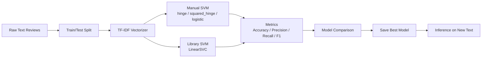

# Text Classification with Manual and Library SVM

<div align="center">


A practical text sentiment classification project that implements a manual SVM from scratch and benchmarks it against scikit-learn's `LinearSVC`.

</div>

## Table of Contents

- [Overview](#overview)
- [Repository Structure](#repository-structure)
- [Quick Architecture Diagram](#quick-architecture-diagram)
- [Workflow](#workflow)
- [Sample Results](#sample-results)
- [Setup](#setup)
- [Run](#run)
- [Notes](#notes)
- [Tech Stack](#tech-stack)
- [Future Improvements](#future-improvements)

## Overview

This project demonstrates end-to-end text classification for sentiment analysis using TF-IDF features and SVM-based models.

It includes:
- A custom `ManualSVM` implementation with three loss variants: hinge, squared hinge, and logistic.
- A benchmark model using scikit-learn's `LinearSVC`.
- Training and evaluation workflow inside a single notebook.
- Saved artifacts for downstream inference:
  - `vectorizer.pkl`
  - `best_model.pkl`

## Repository Structure

```text
.
├── manual_svm_text_classification.ipynb
├── requirements.txt
├── vectorizer.pkl
└── best_model.pkl
```

## Quick Architecture Diagram



## Workflow

1. Load and inspect the dataset.
2. Normalize labels for binary sentiment classification.
3. Split data into training and test sets.
4. Convert text to TF-IDF vectors.
5. Train manual SVM models with multiple losses.
6. Evaluate and compare against `LinearSVC`.
7. Save the vectorizer and best-performing model.
8. Run a sample prediction.

## Sample Results

Use this table format to document final model performance after running the notebook:

| Model | Accuracy | Precision | Recall | F1 |
|---|---:|---:|---:|---:|
| Manual SVM (hinge) | 0.8874 | 0.875168 | 0.905735 | 0.890189 |
| Manual SVM (squared hinge) | 0.8881 | 0.878378 | 0.902957 | 0.890498 |
| Manual SVM (logistic) | 0.8759 | 0.854291 | 0.908712 | 0.880662 |
| LinearSVC (benchmark) | 0.8846 | 0.876526 | 0.897400 | 0.886841 |

These values are populated from the saved notebook comparison output.

## Setup

### 1) Create and activate a virtual environment

```bash
python3 -m venv .venv
source .venv/bin/activate
```

### 2) Install dependencies

```bash
pip install -r requirements.txt
```

## Run

Open and run the notebook:

```bash
jupyter notebook manual_svm_text_classification.ipynb
```

or

```bash
jupyter lab manual_svm_text_classification.ipynb
```

## Notes

- The current notebook uses a local Windows CSV path for dataset loading. Update that cell to your local dataset path before running.
- Ensure your dataset includes text and label columns matching notebook expectations.

## Tech Stack

- Python
- NumPy
- Pandas
- scikit-learn
- Matplotlib
- Joblib

## Future Improvements

- Add a standalone training script (`train.py`) for reproducible CLI training.
- Add an inference API endpoint with Flask/FastAPI.
- Add experiment tracking and confusion matrix visualizations.
- Add unit tests for `ManualSVM` behavior and edge cases.
